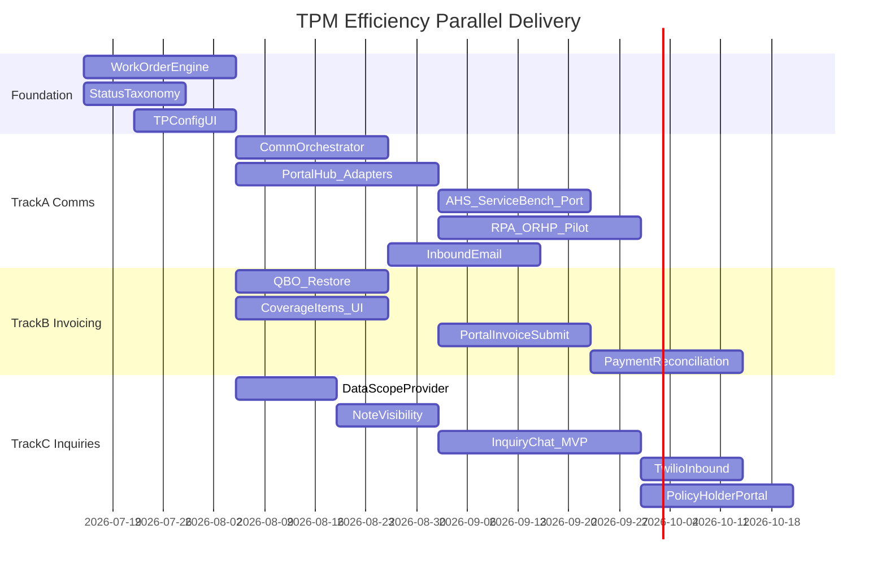

# TPM Efficiency Applications — Deep Implementation Plan

## Problem Statement

Contractors using TPM manage work from **~22 warranty/third-party (TP) companies** (AHS, ServiceBench, ORHP, and ~20 EWOC accounts). Today they face three major pain points:

1. **Communications** — Manual portal updates for most TPs; constant back-and-forth on status, authorization, and questions
2. **Invoicing** — Manual portal invoice submission; no integrated non-covered item workflow
3. **Inquiries** — Frequent calls from TPs and policy holders; no self-service or AI-assisted answers

**Client's first question:** *Can we do it at all?* **Answer: Yes** — the database schema in [`msSchedulerV3.sql`](C:/Users/Saruf/Source/Repos/TPM/TPM/Database/msSchedulerV3.sql) already anticipates this platform. The gap is **application code**, not greenfield design.

---

## Current State vs Target

| Capability | Today | Target |
|------------|-------|--------|
| AHS / ServiceBench status | Automated in **Mobilize** legacy (`tbl_AHSStatusBuffer`, `AHSStatusForPro`) — **not in TPM** | Port or re-implement in TPM status engine |
| EWOC portal status updates | Manual (ORHP-style portal login) | Hybrid: API where available, RPA for portal-only TPs |
| Acknowledgement / confirmation emails | **Accept TP Work Order only** ([`AppoinementList.aspx.cs`](C:/Users/Saruf/Source/Repos/TPM/TPM/AppoinementList.aspx.cs) lines 303–370) | Full lifecycle per client status list |
| Customer status SMS/email | [`AppointmentStatusCommunicationProcessor`](C:/Users/Saruf/Source/Repos/TPM/TPM/Processors/AppointmentStatusCommunicationProcessor.cs) — customer only, not TP | Extend to TP + policy holder with templates |
| Portal access link | Placeholder `href='#'` in [`ThirdPartyProviders.aspx`](C:/Users/Saruf/Source/Repos/TPM/TPM/ThirdPartyProviders.aspx) | Live portal link + one-click status push |
| Invoice creation | Local `tbl_Invoice` save; CEC deep links only | CEC/QBO create → TP portal submit |
| Non-covered items | **Not implemented** | `tbl_WorkOrderCoverageItems` + linked homeowner invoice |
| Payment reconciliation | Read-only `AmountCollect` math | `tbl_TPMPayments` matching |
| TP / policy holder inquiries | Manual phone/SMS; broken [`CustomerChatHistory`](C:/Users/Saruf/Source/Repos/TPM/TPM/CustomerChatHistory.aspx.cs) | AI chat with scoped CSL data access |

---

## Target Architecture

```mermaid
flowchart TB
    subgraph ui [TPM Web App]
        WOList["AppoinementList / CustomerDetails"]
        Settings["Settings.aspx"]
        TPProviders["ThirdPartyProviders.aspx"]
        InvoiceUI["InvoiceCreate.aspx"]
        ChatUI["Inquiry Chat UI"]
    end

    subgraph core [New Core Services]
        WOEngine["WorkOrderEngine"]
        StatusEngine["StatusTransitionEngine"]
        CommEngine["CommunicationOrchestrator"]
        PortalHub["PortalIntegrationHub"]
        InvoiceSvc["TPMInvoiceService"]
        ChatSvc["InquiryChatService"]
        DataScope["CSLDataScopeProvider"]
    end

    subgraph adapters [Portal Adapters - Hybrid]
        APIAdapter["ApiPortalAdapter"]
        RPAAdapter["RpaPortalAdapter"]
        ManualAdapter["GuidedManualAdapter"]
        AHSAdapter["AHS/ServiceBenchAdapter"]
    end

    subgraph external [External]
        TPs["TP Portals AHS ORHP etc"]
        QBO["QuickBooks Online"]
        CEC["CEC Invoice"]
        Twilio["Twilio SMS"]
        LLM["AI Provider"]
    end

    subgraph db [msSchedulerV3]
        WorkOrders["tbl_WorkOrders"]
        TPMComms["tbl_TPMCommunications"]
        TPMApi["tbl_TPMApiConfig"]
        TPMInv["tbl_TPMInvoices"]
        Coverage["tbl_WorkOrderCoverageItems"]
    end

    WOList --> WOEngine
    Settings --> CommEngine
    TPProviders --> PortalHub
    InvoiceUI --> InvoiceSvc
    ChatUI --> ChatSvc

    WOEngine --> WorkOrders
    StatusEngine --> WorkOrders
    CommEngine --> TPMComms
    PortalHub --> adapters
    adapters --> TPs
    InvoiceSvc --> TPMInv
    InvoiceSvc --> QBO
    InvoiceSvc --> CEC
    ChatSvc --> DataScope
    ChatSvc --> LLM
    ChatSvc --> Twilio
    AHSAdapter -.->|"reference Mobilize patterns"| MobilizeLegacy["Mobilize.sql procs"]
```



---

## Foundation (All Workstreams — Week 1–3)

Before the three pillars can run in parallel, wire the **TPM data model** that schema defines but code ignores.

### F1. Activate Work Order Model

**Problem:** App uses `tbl_Appointment` directly; TPM schema has richer [`tbl_WorkOrders`](C:/Users/Saruf/Source/Repos/TPM/TPM/Database/msSchedulerV3.sql) with `ThirdPartyId`, `PolicyHolderId`, `AppointmentId` link, and [`tbl_WorkOrderStatusHistory`](C:/Users/Saruf/Source/Repos/TPM/TPM/Database/msSchedulerV3.sql).

**Actions:**
- Create `Processors/WorkOrderProcessor.cs` — CRUD, status transitions, link to `tbl_Appointment`
- On work order accept/create in [`AppoinementList.aspx.cs`](C:/Users/Saruf/Source/Repos/TPM/TPM/AppoinementList.aspx.cs): upsert `tbl_WorkOrders` + log `tbl_WorkOrderStatusHistory`
- Map `tbl_Appointment.WarrentyCompanyID` → `tbl_ThirdParties` / `tbl_WarrantyCompany`

### F2. Standardize TP Status Taxonomy

Implement the client's required statuses as a canonical enum + mapping table:

| Canonical Status | Client Requirement | Triggers |
|------------------|-------------------|----------|
| `New` | Claim just arrived | Auto on WO create |
| `Acknowledged` | Logged + notified | Accept + auto comms |
| `PendingAuthorization` | Awaiting TP approval | Pre-auth submitted |
| `Scheduled` | Tech assigned | Appointment set |
| `InProgress` | On site | FA status sync |
| `AwaitingParts` | Parts backorder | Manual/FA trigger |
| `PendingInfo` | Missing docs | Manual trigger |
| `Approved` | TP approved | Portal/API response |
| `Denied` | TP denied | Portal/API response |
| `InvoiceSubmitted` | Invoice sent | Invoice service |
| `PaymentPending` | Awaiting payment | Invoice service |
| `Reconciled` | Payment matched | Payment service |
| `Closed` | Archived | Manual/auto |
| `Escalated` | Dispute | Manual trigger |

**New table:** `tbl_TPStatusMapping` (CompanyID, ThirdPartyId, CanonicalStatus, PortalStatusCode, PortalStatusLabel) — per-TP portal vocabulary (ORHP uses different labels than AHS).

**Extend:** [`Settings.aspx`](C:/Users/Saruf/Source/Repos/TPM/TPM/Settings.aspx) — replace stub "Optional status settings saved to console" with real persistence.

### F3. Third-Party Provider Configuration UI

Wire existing schema tables (zero C# references today):

| Table | Purpose | UI Location |
|-------|---------|-------------|
| [`tbl_TPMApiConfig`](C:/Users/Saruf/Source/Repos/TPM/TPM/Database/msSchedulerV3.sql) | PortalUrl, ApiEndpoint, SubmissionMethod | Extend `ThirdPartyProviders.aspx` or new admin tab |
| [`tbl_TPMSettings`](C:/Users/Saruf/Source/Repos/TPM/TPM/Database/msSchedulerV3.sql) | PortalEnabled, PortalAutoAccess, AutoProcessEmails | `Settings.aspx` |
| [`tbl_WarrantyCompany`](C:/Users/Saruf/Source/Repos/TPM/TPM/Database/msSchedulerV3.sql) | StatusServiceEndpoint, EnabledStatusReporting | Link to tbl_ThirdParties |
| [`tbl_TPMEmailConfig`](C:/Users/Saruf/Source/Repos/TPM/TPM/Database/msSchedulerV3.sql) | Inbound email parsing rules | Settings admin |

**Fix:** Replace `Access Portal` placeholder with real URL from `tbl_TPMApiConfig.PortalUrl`.

---

## Workstream 1: Communications (Parallel Track A)

### 1A. Communication Orchestrator

**New:** `Processors/CommunicationOrchestrator.cs`

Central dispatcher on every status transition:
1. Load `tbl_TPMCommunicationSettings` for message type (extend beyond `AcceptTPWorkOrder`)
2. Send email/SMS to **policy holder**, **technician**, and/or **TP contact** based on `SendToCustomer`, `SendToResource`, `AutoSend` flags (columns exist in schema, not saved by UI today)
3. Log all outbound to [`tbl_TPMCommunications`](C:/Users/Saruf/Source/Repos/TPM/TPM/Database/msSchedulerV3.sql)
4. Queue portal status push via PortalIntegrationHub

**Extend message types in [`Settings.aspx`](C:/Users/Saruf/Source/Repos/TPM/TPM/Settings.aspx):**

| messageType | Trigger Status | Recipients |
|-------------|---------------|------------|
| `AcceptTPWorkOrder` | Acknowledged | Policy holder + TP | *(exists)*
| `AppointmentConfirmation` | Scheduled | Policy holder + tech |
| `PreAuthorizationRequest` | PendingAuthorization | TP portal |
| `StatusUpdate` | Any transition | TP + policy holder |
| `RequestAdditionalInfo` | PendingInfo | TP |
| `InvoiceNotification` | InvoiceSubmitted | TP + policy holder |
| `EscalationNotice` | Escalated | TP account manager |
| `ClosureConfirmation` | Closed | TP + policy holder |

**Wire triggers:** Currently only [`AppoinementList.aspx.cs`](C:/Users/Saruf/Source/Repos/TPM/TPM/AppoinementList.aspx.cs) fires on Accept. Also hook [`Appointments.aspx.cs`](C:/Users/Saruf/Source/Repos/TPM/TPM/Appointments.aspx.cs) status changes and new WorkOrderEngine transitions.

### 1B. Portal Integration Hub (Hybrid)

**New:** `Processors/PortalIntegrationHub.cs` + adapter interface `IPortalAdapter`

```csharp
interface IPortalAdapter {
    Task<PortalResult> PushStatus(WorkOrderContext ctx, StatusUpdate update);
    Task<PortalResult> SubmitInvoice(InvoiceContext ctx);
    Task<PortalResult> SubmitPreAuthorization(PreAuthContext ctx);
    bool CanHandle(ThirdPartyConfig config);
}
```

**Three adapter implementations:**

| Adapter | When Used | Example TPs |
|---------|-----------|-------------|
| `ApiPortalAdapter` | `SubmissionMethod = 'API'` + endpoint configured | AHS, ServiceBench (StatusServiceEndpoint) |
| `RpaPortalAdapter` | `SubmissionMethod = 'RPA'` + PortalUrl configured | ORHP, portal-only EWOC accounts |
| `GuidedManualAdapter` | No automation config / RPA failure | Fallback with pre-filled form + deep link |

**AHS / ServiceBench specifically:**
- Reference Mobilize implementation: `tbl_AHSStatusBuffer`, `SaveDispatchStatusLog`, `AHSStatusForPro` in [`Mobilize.sql`](C:/Users/Saruf/Source/Repos/TPM/TPM/Database/Mobilize.sql)
- Port status buffer queue pattern into TPM: new `tbl_TPMStatusQueue` (or reuse Mobilize DB if co-deployed)
- Use `tbl_WarrantyCompany.StatusServiceEndpoint` credentials

**RPA approach (ORHP-style portals):**
- Separate Windows service or Azure Function using Playwright/Selenium
- Credentials stored encrypted in `tbl_TPMApiConfig`
- Staff triggers "Push to Portal" or auto on status change when `PortalAutoAccess = true`
- Upload photos/docs from `tbl_AppointmentCSLImages`, technician notes (filtered)

**ORHP portal flow automation target** (from client doc):
1. Login → 2. Navigate Service Calls → 3. Select call → 4. Update status + notes + upload photos → 5. Save

### 1C. Inbound TP Communications

Wire [`tbl_TPMEmails`](C:/Users/Saruf/Source/Repos/TPM/TPM/Database/msSchedulerV3.sql) + [`tbl_TPMEmailConfig`](C:/Users/Saruf/Source/Repos/TPM/TPM/Database/msSchedulerV3.sql):
- Background job polls IMAP/POP3 per TP config
- Parse subject/body for work order reference
- Attach to `tbl_WorkOrders` + notify assigned rep
- Feeds into Inquiry Chat (Workstream 3)

---

## Workstream 2: Invoicing (Parallel Track B)

### 2A. Invoice Creation Pipeline

**Target flow:** FA-PRO billable items → TPM invoice → CEC/QBO → TP portal

| Step | Implementation | Files |
|------|---------------|-------|
| Gather billable items | Link appointment/work order items from `Items` / FA-PRO | [`BillableItems.aspx.cs`](C:/Users/Saruf/Source/Repos/TPM/TPM/BillableItems.aspx.cs) |
| Create covered invoice | Extend [`InvoiceCreate.aspx.cs`](C:/Users/Saruf/Source/Repos/TPM/TPM/InvoiceCreate.aspx.cs) | Set `AppointmentId`, `WarrentyCompanyID` |
| Sync to QBO | **Restore** commented QBO calls; add methods back to [`QBOManager.cs`](C:/Users/Saruf/Source/Repos/TPM/TPM/Processors/QBOManager.cs) | `CreateInvoiceQbo`, `SyncPaymentToQBO` |
| CEC integration | SSO deep link exists; add programmatic push or shared DB write to `myServiceJobs.dbo.Invoices` | [`Invoice.aspx.cs`](C:/Users/Saruf/Source/Repos/TPM/TPM/Invoice.aspx.cs) lines 1055–1109 |
| Track TPM submission | Write to [`tbl_TPMInvoices`](C:/Users/Saruf/Source/Repos/TPM/TPM/Database/msSchedulerV3.sql) with `SubmissionStatus`, `SubmissionId` | New `TPMInvoiceService` |

### 2B. Non-Covered Items Invoice

**Schema ready:** [`tbl_WorkOrderCoverageItems`](C:/Users/Saruf/Source/Repos/TPM/TPM/Database/msSchedulerV3.sql) with `CoverageStatus`, `FAProInvoiceId`, `TPAuthorizationNumber`

**New UI flow on work order detail ([`CustomerDetails.aspx`](C:/Users/Saruf/Source/Repos/TPM/TPM/CustomerDetails.aspx)):**
1. Technician marks line items: Covered / Not Covered / Pending Authorization
2. Covered items → warranty invoice → TP portal
3. Non-covered items → create **linked homeowner customer** (from policy holder data on work order) → separate invoice in CEC/QBO
4. Maintain `AppointmentId` + `WorkOrderId` cross-reference so both invoices tie to same job
5. Homeowner approval workflow (email/SMS link to accept non-covered charges)

**New:** `Processors/CoverageItemProcessor.cs`

### 2C. Portal Invoice Submission

Reuse `PortalIntegrationHub.SubmitInvoice()`:
- Generate TP-specific format (PDF, CSV, or portal form fields — per `tbl_TPMApiConfig.SubmissionMethod`)
- RPA adapter fills portal invoice form (same ORHP session)
- Track `SubmissionStatus`: Draft → Submitted → Accepted → Rejected

### 2D. Payment Reconciliation

Wire [`tbl_TPMPayments`](C:/Users/Saruf/Source/Repos/TPM/TPM/Database/msSchedulerV3.sql):
- Match TP remittance (portal export, email, or QBO payment sync) to `tbl_TPMInvoices`
- Update `PaymentStatus`: PaymentPending → Reconciled
- Sync back to `tbl_Invoice.AmountCollect` and QBO

**Fix broken UI:** [`ThirdPartyProviders.aspx`](C:/Users/Saruf/Source/Repos/TPM/TPM/ThirdPartyProviders.aspx) invoice menu items use empty `cId=` — wire to actual customer GUID.

---

## Workstream 3: AI Inquiries (Parallel Track C)

### 3A. Data Access Layer (Critical — Client Concern)

**Client requirement:** Control what data policy holders and TPs can see. Technicians write internal notes that must not leak.

**Schema changes to [`tbl_Note`](C:/Users/Saruf/Source/Repos/TPM/TPM/Database/msSchedulerV3.sql):**
```sql
ALTER TABLE tbl_Note ADD VisibilityScope nvarchar(20) DEFAULT 'Internal';
-- Values: Internal, ThirdParty, PolicyHolder, Public
ALTER TABLE tbl_Note ADD IsAiAccessible bit DEFAULT 0;
```

**New:** `Processors/CSLDataScopeProvider.cs`

Scoped context builder per channel:

| Channel | Allowed Data | Blocked |
|---------|-------------|---------|
| PolicyHolder Chat | Status, dates, tech name, ETA, public notes | Internal notes, cost details, TP auth amounts |
| TP Company Chat | Status, diagnosis summary, coverage items, auth status | Internal notes, competitor info |
| Staff (existing) | Full CSL drawer | — |

Refactor [`GetCslDrawerData`](C:/Users/Saruf/Source/Repos/TPM/TPM/CustomerDetails.aspx.cs) to accept a `DataScope` parameter instead of returning everything.

**Settings control:** Per-company config in `tbl_TPMSettings` — which fields each channel can access.

### 3B. Inquiry Chat Service

**New pages:**
- `PolicyHolderInquiry.aspx` — customer-facing chat (token-based auth, no staff SSO)
- `TPInquiry.aspx` — TP company chat portal
- Extend staff view in [`CustomerDetails.aspx`](C:/Users/Saruf/Source/Repos/TPM/TPM/CustomerDetails.aspx) with inquiry thread panel

**New:** `Processors/InquiryChatService.cs`
- Conversation stored in new `tbl_TPMInquiryThreads` + `tbl_TPMInquiryMessages`
- LLM integration (OpenAI/Azure OpenAI) with system prompt + scoped CSL context from `CSLDataScopeProvider`
- Human escalation flag when AI confidence low or customer requests rep
- Fix [`CustomerChatHistory.aspx.cs`](C:/Users/Saruf/Source/Repos/TPM/TPM/CustomerChatHistory.aspx.cs) `GetMessages` stub

**Channels:**
- Web chat widget (policy holder portal — replace mislabeled [`Dashboard.aspx`](C:/Users/Saruf/Source/Repos/TPM/TPM/Dashboard.aspx) nav item)
- SMS via Twilio inbound webhook (session flag `IsInboundSMSAllowed` exists but unused)
- Email replies via `tbl_TPMEmails` processing

### 3C. AI Safety & Audit

- All AI responses logged with source data references
- Implement missing `GetAccessLogList` in [`TpDetail.aspx.cs`](C:/Users/Saruf/Source/Repos/TPM/TPM/TpDetail.aspx.cs) (called by JS but not implemented)
- Rate limiting per work order / per phone number
- Company-configurable: AI enabled/disabled, auto-reply vs suggest-only for staff

---

## Implementation Sequence (Parallel Tracks)



---

## Key Files to Create/Modify

### New files
| File | Workstream |
|------|-----------|
| `Processors/WorkOrderProcessor.cs` | Foundation |
| `Processors/CommunicationOrchestrator.cs` | Comms |
| `Processors/PortalIntegrationHub.cs` | Comms |
| `Processors/PortalAdapters/ApiPortalAdapter.cs` | Comms |
| `Processors/PortalAdapters/RpaPortalAdapter.cs` | Comms |
| `Processors/PortalAdapters/GuidedManualAdapter.cs` | Comms |
| `Processors/TPMInvoiceService.cs` | Invoicing |
| `Processors/CoverageItemProcessor.cs` | Invoicing |
| `Processors/CSLDataScopeProvider.cs` | Inquiries |
| `Processors/InquiryChatService.cs` | Inquiries |
| `PolicyHolderInquiry.aspx` + `.cs` | Inquiries |
| `Database/TPM_Efficiency_Migration.sql` | All |

### Modify existing
| File | Changes |
|------|---------|
| [`AppoinementList.aspx.cs`](C:/Users/Saruf/Source/Repos/TPM/TPM/AppoinementList.aspx.cs) | Delegate to WorkOrderEngine + CommunicationOrchestrator |
| [`Appointments.aspx.cs`](C:/Users/Saruf/Source/Repos/TPM/TPM/Appointments.aspx.cs) | Hook status changes to orchestrator |
| [`Settings.aspx`](C:/Users/Saruf/Source/Repos/TPM/TPM/Settings.aspx) / `.cs` | All message types, TP config, data scope settings |
| [`ThirdPartyProviders.aspx`](C:/Users/Saruf/Source/Repos/TPM/TPM/ThirdPartyProviders.aspx) | Portal URL, push status, invoice links |
| [`InvoiceCreate.aspx.cs`](C:/Users/Saruf/Source/Repos/TPM/TPM/InvoiceCreate.aspx.cs) | Coverage split, QBO sync, portal submit |
| [`QBOManager.cs`](C:/Users/Saruf/Source/Repos/TPM/TPM/Processors/QBOManager.cs) | Restore invoice/payment methods |
| [`CustomerDetails.aspx.cs`](C:/Users/Saruf/Source/Repos/TPM/TPM/CustomerDetails.aspx.cs) | Coverage items UI, scoped CSL, inquiry panel |
| [`CustomerChatHistory.aspx.cs`](C:/Users/Saruf/Source/Repos/TPM/TPM/CustomerChatHistory.aspx.cs) | Fix GetMessages, integrate with inquiry service |
| [`TPM.Master`](C:/Users/Saruf/Source/Repos/TPM/TPM/TPM.Master) | Real Policy Holder Portal link |

---

## Feasibility Assessment (Client's "Can We Do It?")

| Feature | Feasible? | Risk | Notes |
|---------|-----------|------|-------|
| AHS/ServiceBench auto status | **Yes** | Low | Proven in Mobilize; port queue pattern |
| ORHP-style portal RPA | **Yes** | Medium | Playwright works but portals change UI; needs maintenance budget |
| Universal portal adapter | **Partially** | High | Each TP portal differs; start with 5–6 main TPs, template for others |
| Invoice portal upload | **Yes** | Medium | Depends on TP accepting PDF/file upload vs form-only |
| Non-covered item workflow | **Yes** | Low | Schema exists; mostly UI + invoice logic |
| QBO invoice sync | **Yes** | Low | Code existed; was commented out |
| AI policy holder chat | **Yes** | Medium | LLM + scoped data works; needs careful visibility controls |
| AI TP chat | **Yes** | Medium | Same architecture, different data scope |
| Full unattended automation | **No (initially)** | — | Hybrid with staff confirmation for auth, denial, escalation |

---

## Risks and Mitigations

1. **Portal UI changes break RPA** — Mitigate with adapter versioning per TP; fallback to GuidedManualAdapter
2. **Data leakage via AI** — Mitigate with `CSLDataScopeProvider` allowlists; never pass raw notes to LLM without scope filter
3. **Mobilize vs TPM duplication** — Decide: port AHS logic into TPM vs call Mobilize DB procs; recommend port for long-term
4. **Missing `ConnStrSch`** — Fix in [`Web.config`](C:/Users/Saruf/Source/Repos/TPM/TPM/Web.config) as part of Foundation (point to msSchedulerV3)
5. **22 TP companies, 6 priorities** — Build adapter template; configure per TP in `tbl_TPMApiConfig`; don't hardcode per company

---

## Success Criteria

- Staff accepts work order → auto acknowledgement to TP + policy holder within 5 minutes
- Status change in TPM → pushed to TP portal (API or RPA) without manual login for configured TPs
- Invoice created from work order → submitted to TP portal with submission tracking
- Non-covered items generate separate homeowner invoice linked to original work order
- Policy holder asks "when is my appointment?" via chat → AI answers from scoped CSL data only
- TP asks "what is the authorization status?" → AI answers without exposing internal tech notes
- All communications logged in `tbl_TPMCommunications` with audit trail
