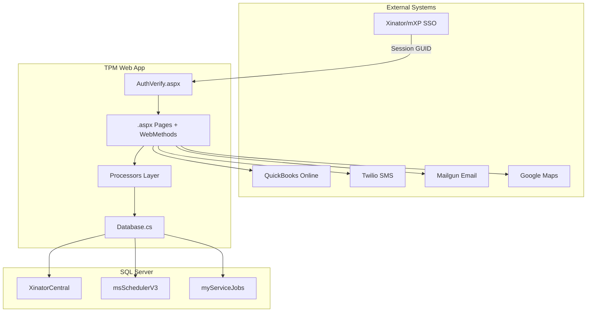
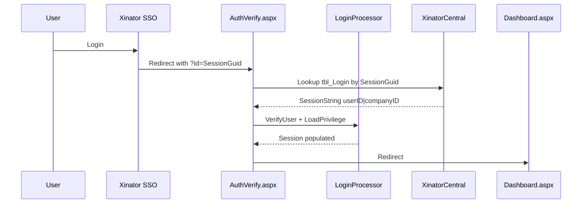
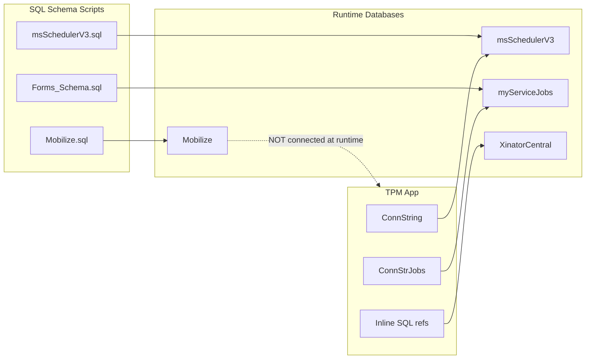

# TPM Project Overview

## What This Project Is

**TPM** (Third Party Management) is an **ASP.NET Web Forms** application on **.NET Framework 4.6.1**, evolved from an earlier **FSM** (Field Service Management) codebase. It manages third-party service providers, work orders, appointments, customers, forms, invoicing, and dispatch for multi-tenant field-service companies.

- Solution: [`TPM.sln`](C:/Users/Saruf/Source/Repos/TPM/TPM.sln)
- Main project: [`TPM/TPM.csproj`](C:/Users/Saruf/Source/Repos/TPM/TPM/TPM.csproj)
- No root README; only DB docs in [`TPM/Database/README_FixMissingProcedure.md`](C:/Users/Saruf/Source/Repos/TPM/TPM/Database/README_FixMissingProcedure.md)

---

## Architecture

### Layer breakdown

| Layer | Location | Pattern |
|-------|----------|---------|
| UI | 21 `.aspx` pages + [`TPM.Master`](C:/Users/Saruf/Source/Repos/TPM/TPM/TPM.Master) | Web Forms with Bootstrap 5, jQuery, DataTables, SweetAlert2 |
| AJAX API | `[WebMethod]` static methods on page code-behinds | No separate Web API project |
| Business logic | [`TPM/Processors/`](C:/Users/Saruf/Source/Repos/TPM/TPM/Processors/) | Partially extracted; much SQL still inline in pages |
| Data access | [`TPM/Database.cs`](C:/Users/Saruf/Source/Repos/TPM/TPM/Database.cs) | Custom ADO.NET wrapper (no EF) |
| Domain models | [`TPM/Entity/`](C:/Users/Saruf/Source/Repos/TPM/TPM/Entity/), [`TPM/Models/`](C:/Users/Saruf/Source/Repos/TPM/TPM/Models/) | Entities, DTOs, privilege models |
| DB scripts | [`TPM/Database/`](C:/Users/Saruf/Source/Repos/TPM/TPM/Database/) | Schema, stored procs, setup/fix scripts |

**Namespace split:** `FSM` (legacy) and `TPM` coexist across pages and processors.

---

## Authentication Flow

No ASP.NET Membership. Uses **SSO session handoff** from the Xinator/mXP platform.

Key files:
- [`TPM/AuthVerify.aspx.cs`](C:/Users/Saruf/Source/Repos/TPM/TPM/AuthVerify.aspx.cs) — SSO entry + dev `?BYPass` bypass
- [`TPM/Processors/LoginProcessor.cs`](C:/Users/Saruf/Source/Repos/TPM/TPM/Processors/LoginProcessor.cs) — user verification, privilege loading
- [`TPM/Dashboard.aspx.cs`](C:/Users/Saruf/Source/Repos/TPM/TPM/Dashboard.aspx.cs) — auth gate
- [`TPM/logout.aspx`](C:/Users/Saruf/Source/Repos/TPM/TPM/logout.aspx) — session clear + SSO logout redirect

**Recent uncommitted change in AuthVerify:** dev bypass switched from `xxacrescue`/`13202` to `msProDemo1`/`admin.prodemo@myserviceforce.com`.

**Auth quirks to be aware of:**
- Line 73 of AuthVerify always redirects to Dashboard even on failed verification
- `?BYPass` with hardcoded credentials exists in production code
- Session checks are manual (`Session["CompanyID"]`) on each page, not middleware

---

## Databases

### Authoritative SQL Schema Scripts

The software's data model is defined by two full database scripts in [`TPM/Database/`](C:/Users/Saruf/Source/Repos/TPM/TPM/Database/):

| Script | Database | Size | Tables | Stored Procs | Role |
|--------|----------|------|--------|--------------|------|
| [`msSchedulerV3.sql`](C:/Users/Saruf/Source/Repos/TPM/TPM/Database/msSchedulerV3.sql) | `msSchedulerV3` | ~9,800 lines | 192 | 24 | **Primary TPM database** — all core app queries |
| [`Mobilize.sql`](C:/Users/Saruf/Source/Repos/TPM/TPM/Database/Mobilize.sql) | `Mobilize` | ~41,600 lines | 239 | 100 | **Legacy parent platform** — work-order dispatch ecosystem |

Both scripts use the `Mobilizedba` SQL login and were exported on 7/8/2026.

### Runtime Connection Mapping

| Connection key | Database | Schema script | Used for |
|----------------|----------|---------------|----------|
| `ConnString` | `msSchedulerV3` | `msSchedulerV3.sql` | Customers, appointments, invoices, items, privileges, SMS settings, warranty companies |
| `ConnStrJobs` | `myServiceJobs` | `Forms_Schema.sql` (separate) | Forms, QBO settings, some items/invoices |
| `ConnStrSch` | *(missing from Web.config)* | — | Referenced by `TpList`, `BusinessContact` — likely should point to `msSchedulerV3` |
| *(inline)* | `XinatorCentral` | *(not in repo)* | SSO sessions (`tbl_Login`), users, companies |
| *(none)* | `Mobilize` | `Mobilize.sql` | **Not queried by TPM code** — legacy platform in same ecosystem |

### msSchedulerV3 — Tables TPM Actively Uses

Defined in [`msSchedulerV3.sql`](C:/Users/Saruf/Source/Repos/TPM/TPM/Database/msSchedulerV3.sql), queried via `ConnString`:

| Table | TPM Feature |
|-------|-------------|
| `tbl_Customer` | Customer list, third-party providers, business contacts |
| `tbl_CustomerSite` | Service locations, site email/mobile |
| `tbl_Appointment` | Work orders / appointments (has `WarrentyCompanyID` column) |
| `tbl_WarrantyCompany` | Supported TP providers catalog |
| `tbl_AssignWarrantyCompany` | Warranty company assignment |
| `tbl_Resources` | Field agents / technicians |
| `tbl_FaProfile` | Field agent content profiles (SMS/email templates) |
| `tbl_FSMSMSSettings` | SMS configuration per company |
| `tbl_Privelege` | User role permissions |
| `tbl_Invoice` / `tbl_InvoiceDetails` | Invoicing |
| `Items` / `ItemGroups` / `ItemGroupLinks` | Billable items |
| `tbl_Status` / `AppointmentStatus` | Appointment statuses |
| `CustomFields` / `AppointmentCustomFields` | Custom field definitions |
| `tbl_CommunicationSettings` | Email/SMS templates |
| `Tbl_CSLTag` | Customer tags |
| `FormTemplates` | Form templates (also in msSchedulerV3) |

Key stored procedures TPM uses: `sp_BatchUpdateAppointmentStatus`, `sp_LogAppointmentStatusChange`, `sp_GetCommunicationSettings`, `Get_DisptachBoard_Data`, `Sp_GetAppointmnetData`.

### Mobilize — Legacy Platform (Not Directly Queried)

Defined in [`Mobilize.sql`](C:/Users/Saruf/Source/Repos/TPM/TPM/Database/Mobilize.sql). TPM code has **zero references** to Mobilize tables (`tbl_workOrder`, `tbl_customer`, `tbl_site`, etc.).

| Mobilize concept | msSchedulerV3 equivalent | Notes |
|------------------|--------------------------|-------|
| `tbl_workOrder` | `tbl_Appointment` | Legacy work-order model vs newer appointment model |
| `tbl_customer` (lowercase) | `tbl_Customer` | Different schema/naming |
| `tbl_site` | `tbl_CustomerSite` | Site/location data |
| `tbl_workOrderAssignment` | `tbl_Assignment` / `tbl_Resources` | Technician dispatch |
| `tbl_WarrantyCompany` | `tbl_WarrantyCompany` | **Shared table** — exists in both databases |
| `tbl_Technician` | `tbl_Resources` | Field service workers |
| `HangFire` schema | — | Background job processing (Mobilize only) |

Mobilize is the broader field-service dispatch platform. TPM is built on the newer `msSchedulerV3` scheduler model but shares warranty-company concepts from the Mobilize ecosystem.

### Cross-Database References

- `msSchedulerV3.sql` stored procs reference `myServiceJobs.dbo.tbl_ResourceGroupMapping` — proving the two DBs are linked at the SQL level
- TPM pages use three-part names like `[msSchedulerV3].[dbo].[tbl_Customer]` and `[myServiceJobs].[dbo].[FormResponse]` in inline SQL
- Auth uses `XinatorCentral.dbo.tbl_Login` (not defined in either script)

---

## Main Features & Pages

### Sidebar navigation ([`TPM.Master`](C:/Users/Saruf/Source/Repos/TPM/TPM/TPM.Master))

| Page | Feature |
|------|---------|
| [`Dashboard.aspx`](C:/Users/Saruf/Source/Repos/TPM/TPM/Dashboard.aspx) | Landing page, auth gate |
| [`AppoinementList.aspx`](C:/Users/Saruf/Source/Repos/TPM/TPM/AppoinementList.aspx) | New Work Orders list |
| [`TpList.aspx`](C:/Users/Saruf/Source/Repos/TPM/TPM/TpList.aspx) | Third Party Providers |
| [`Customer.aspx`](C:/Users/Saruf/Source/Repos/TPM/TPM/Customer.aspx) | Service Locations |
| [`ThirdPartyProviders.aspx`](C:/Users/Saruf/Source/Repos/TPM/TPM/ThirdPartyProviders.aspx) | Supported TP Providers |
| [`Settings.aspx`](C:/Users/Saruf/Source/Repos/TPM/TPM/Settings.aspx) | App settings |

### Additional pages (not all in sidebar)

| Page | Feature |
|------|---------|
| [`Appointments.aspx`](C:/Users/Saruf/Source/Repos/TPM/TPM/Appointments.aspx) | Full scheduling board (status, dispatch, SMS/email, forms) |
| [`Dispatch.aspx`](C:/Users/Saruf/Source/Repos/TPM/TPM/Dispatch.aspx) | Dispatch board (JS-driven shell) |
| [`CustomerDetails.aspx`](C:/Users/Saruf/Source/Repos/TPM/TPM/CustomerDetails.aspx) | Deep customer/work-order detail (~3000+ lines) |
| [`TpDetail.aspx`](C:/Users/Saruf/Source/Repos/TPM/TPM/TpDetail.aspx) | Third-party provider detail |
| [`BusinessContact.aspx`](C:/Users/Saruf/Source/Repos/TPM/TPM/BusinessContact.aspx) | Business contact management |
| [`BillableItems.aspx`](C:/Users/Saruf/Source/Repos/TPM/TPM/BillableItems.aspx) | Billable items + QBO sync |
| [`Invoice.aspx`](C:/Users/Saruf/Source/Repos/TPM/TPM/Invoice.aspx) / [`InvoiceCreate.aspx`](C:/Users/Saruf/Source/Repos/TPM/TPM/InvoiceCreate.aspx) | Invoicing |
| [`Forms.aspx`](C:/Users/Saruf/Source/Repos/TPM/TPM/Forms.aspx) / [`FormResponse.aspx`](C:/Users/Saruf/Source/Repos/TPM/TPM/FormResponse.aspx) | Form templates & responses |
| [`QboConnection.aspx`](C:/Users/Saruf/Source/Repos/TPM/TPM/QboConnection.aspx) | QuickBooks OAuth |
| [`SMSSettings.aspx`](C:/Users/Saruf/Source/Repos/TPM/TPM/SMSSettings.aspx) | SMS config |
| [`CustomerChatHistory.aspx`](C:/Users/Saruf/Source/Repos/TPM/TPM/CustomerChatHistory.aspx) | SMS chat history |
| [`ItemImageUpload.ashx`](C:/Users/Saruf/Source/Repos/TPM/TPM/ItemImageUpload.ashx) | Image upload handler |

---

## Processors (Business Logic)

| Processor | Responsibility |
|-----------|----------------|
| [`LoginProcessor.cs`](C:/Users/Saruf/Source/Repos/TPM/TPM/Processors/LoginProcessor.cs) | Auth, privileges, company-type flags (LHG, mXP, Aire-Master, PCS) |
| [`CustomerProcessor.cs`](C:/Users/Saruf/Source/Repos/TPM/TPM/Processors/CustomerProcessor.cs) | Customer CRUD |
| [`BusinessContactProcessor.cs`](C:/Users/Saruf/Source/Repos/TPM/TPM/Processors/BusinessContactProcessor.cs) | Business contacts |
| [`FormProcessor.cs`](C:/Users/Saruf/Source/Repos/TPM/TPM/Processors/FormProcessor.cs) | Form templates/instances via `sp_Forms_*` |
| [`QBOManager.cs`](C:/Users/Saruf/Source/Repos/TPM/TPM/Processors/QBOManager.cs) | QuickBooks Online integration |
| [`EmailProcessor.cs`](C:/Users/Saruf/Source/Repos/TPM/TPM/Processors/EmailProcessor.cs) | Email notifications (~3900 lines) |
| [`AppointmentStatusCommunicationProcessor.cs`](C:/Users/Saruf/Source/Repos/TPM/TPM/Processors/AppointmentStatusCommunicationProcessor.cs) | Status-change SMS/email |
| [`UserLogProcessor.cs`](C:/Users/Saruf/Source/Repos/TPM/TPM/Processors/UserLogProcessor.cs) | Activity logging |

---

## External Integrations

Configured in [`TPM/Web.config`](C:/Users/Saruf/Source/Repos/TPM/TPM/Web.config):
- **QuickBooks Online** — Intuit SDK (`Intuit.Ipp.*`), OAuth via `QboConnection.aspx`
- **Twilio** — SMS/MMS via [`TwilioSMSService.cs`](C:/Users/Saruf/Source/Repos/TPM/TPM/SMSService/TwilioSMSService.cs)
- **Mailgun SMTP** — email via `EmailProcessor`
- **Google Maps** — dispatch/map views
- **Xinator/mXP SSO** — central login portal

---

## Multi-Tenant & Multi-Brand

- All data scoped by `Session["CompanyID"]`
- Branding switches in [`TPM.Master.cs`](C:/Users/Saruf/Source/Repos/TPM/TPM/TPM.Master.cs) based on session flags: `IsLHG`, `mXP`, default TPM
- Privilege model in [`Models/UserModels/UserPrivilege.cs`](C:/Users/Saruf/Source/Repos/TPM/TPM/Models/UserModels/UserPrivilege.cs) controls feature access per user

---

## Known Gaps & Risks

1. **`ConnStrSch` missing** from Web.config but referenced in `TpList`, `BusinessContact`, and `Database.BeginTransaction` — will fail at runtime
2. **SQL injection risk** — widespread string-concatenated SQL in auth/login paths (e.g., AuthVerify line 18)
3. **AuthVerify always redirects** to Dashboard even on failed verification (line 73)
4. **Dev bypass** (`?BYPass`) with hardcoded credentials in production code
5. **Namespace inconsistency** — `FSM` vs `TPM` across the codebase
6. **Secrets in Web.config** — DB credentials, SMTP, OAuth keys, API keys committed in config

---

## Current Git State

Uncommitted changes:
- [`AuthVerify.aspx.cs`](C:/Users/Saruf/Source/Repos/TPM/TPM/AuthVerify.aspx.cs) — dev bypass credentials switched to `msProDemo1`
- [`Web.config`](C:/Users/Saruf/Source/Repos/TPM/TPM/Web.config) — config changes
- [`Database/Mobilize.sql`](C:/Users/Saruf/Source/Repos/TPM/TPM/Database/Mobilize.sql) — new untracked SQL script
- Build artifacts (`bin/`, `obj/`, `.vs/`)

---

## Ready for Your Task

The project has been fully read and mapped. Describe your specific task in your next message and I will create a targeted implementation plan.
